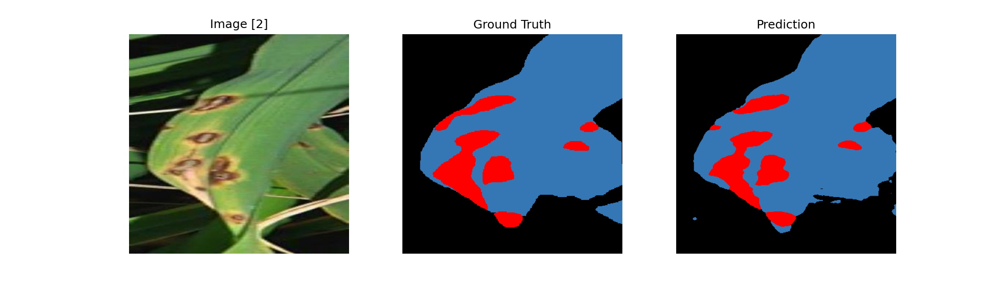
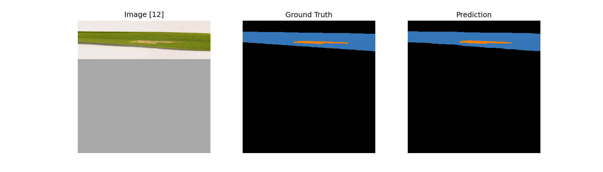
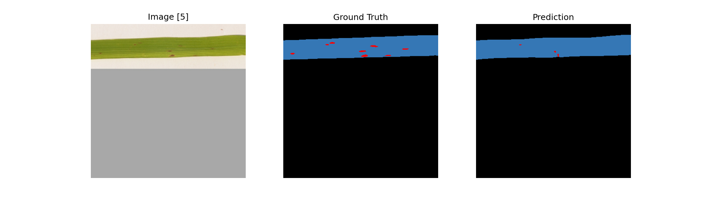
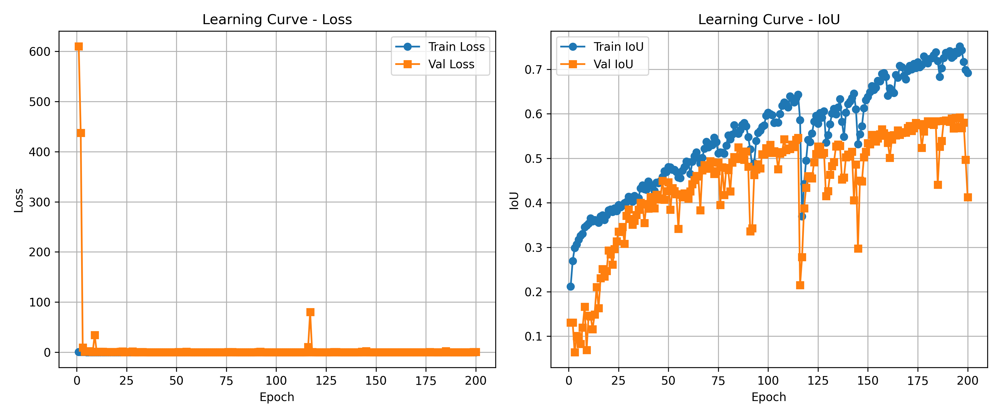
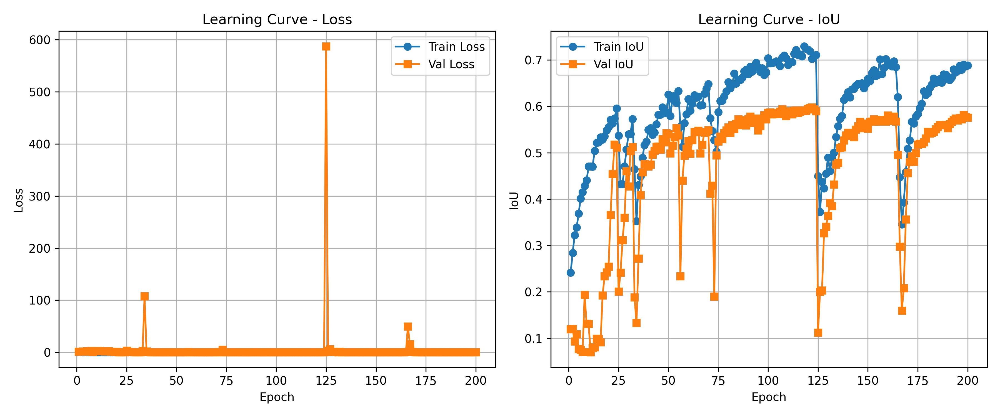

# Segmentasi Semantik Penyakit Daun Padi

Notebook penelitian untuk membandingkan U-Net, PSPNet, dan DeepLabV3+ dalam mengidentifikasi area penyakit pada daun padi dan menganalisis tingkat keparahannya. Kode berasal dari proyek skripsi Azaria Syahla Fitan Adibah. Versi ini mempertahankan kode notebook yang diterima; hanya output eksekusi yang dihapus agar repo lebih ringan dan tidak menampilkan isi Google Drive.

## Isi repositori

| Notebook | Framework | Arsitektur |
| --- | --- | --- |
| `notebooks/unet.ipynb` | TensorFlow/Keras, `segmentation-models` | U-Net, encoder ResNet34 |
| `notebooks/pspnet.ipynb` | TensorFlow/Keras, `segmentation-models` | PSPNet, encoder ResNet34 |
| `notebooks/deeplabv3plus.ipynb` | PyTorch, `segmentation-models-pytorch` | DeepLabV3+, encoder ResNet34 |

Notebook menggunakan citra 384 × 384 dengan lima kelas: background, healthy leaf, bacterial blight, blast, dan brown spot. Bagian utama masing-masing mencakup persiapan data, pelatihan, evaluasi, dan analisis keparahan.

## Contoh visualisasi

Gambar di bawah memperlihatkan citra, mask acuan (*ground truth*), dan mask prediksi. Arsip hasil yang diterima berisi nama file berulang tanpa penanda arsitektur atau epoch, sehingga contoh ini **tidak diatribusikan ke model tertentu** dan tidak digunakan untuk menyimpulkan metrik.







## Kurva pelatihan

Arsip kurva memuat grafik U-Net dan PSPNet untuk beberapa jumlah epoch. Berikut grafik yang bernama 200 epoch sesuai masing-masing model. Kurva DeepLabV3+ belum tersedia dalam arsip yang diterima. Beberapa titik *validation loss* melonjak tajam, sehingga skala grafik loss kurang memperlihatkan perubahan pada epoch lain; lihat pula kurva IoU di panel kanan.

**U-Net, 200 epoch**



**PSPNet, 200 epoch**



## Data dan cara menjalankan

Dataset penuh dan bobot model tidak disertakan. Notebook aslinya dijalankan di Google Colab dan membaca folder Google Drive berikut:

```text
MyDrive/Draft Skripsi/
├── Dataset/
│   ├── JPEGImages/
│   └── SegmentationClass/
├── Model/
└── learning_curve/
```

1. Siapkan dataset gambar dan mask dalam `JPEGImages` dan `SegmentationClass`. Gunakan dataset dan izin distribusi dari sumber asal penelitian; tautan spesifiknya perlu ditambahkan oleh pemilik proyek.
2. Buka notebook pilihan di Google Colab. Mount Google Drive saat diminta.
3. Sesuaikan `BASE_DATA_DIR`, path model, dan path keluaran jika lokasi folder berbeda.
4. Jalankan sel dari atas ke bawah. Notebook memasang paket segmentasi melalui sel `pip`; dependensi lain mencakup NumPy, Matplotlib, scikit-learn, OpenCV, tqdm, serta TensorFlow/Keras untuk U-Net dan PSPNet atau PyTorch, Albumentations, dan torchinfo untuk DeepLabV3+.

Versi paket dan lingkungan pelatihan asli belum disertakan, sehingga hasil reproduksi dapat berbeda. Model pralatih dan sebagian paket memerlukan akses internet saat pertama dijalankan.

## Catatan pemeriksaan sebelum memakai hasil

- **PSPNet:** sel evaluasi dalam file yang diterima menunjuk `MODEL_PATH` ke `Model/unet/unet_best_val_iou_200.keras`. Ganti dengan checkpoint PSPNet yang sesuai sebelum mengevaluasi PSPNet. Kode asli tidak diubah diam-diam.
- **DeepLabV3+:** sel evaluasi menunjuk `deeplabv3plus_last_200.pth`, sedangkan pelatihan juga menyimpan checkpoint terbaik. Pilih checkpoint sesuai hasil yang hendak dilaporkan.
- Notebook memuat path khusus Google Drive peneliti. File model dan dataset harus tersedia pada path yang dipakai kode.
- Angka metrik penelitian belum diverifikasi dari notebook yang sudah dibersihkan karena output dan data lengkap tidak disertakan.

## Rumus keparahan

Tingkat keparahan dihitung dari perbandingan luas area terinfeksi dengan luas area daun, dikalikan 100%. Lihat sel analisis masing-masing notebook untuk implementasi dan visualisasinya.

## Status

Repositori ini adalah paket kode penelitian dengan contoh visualisasi. Tambahkan tautan dataset dan sitasi publikasi/skripsi setelah diverifikasi sebelum menjadikannya portofolio publik final.
